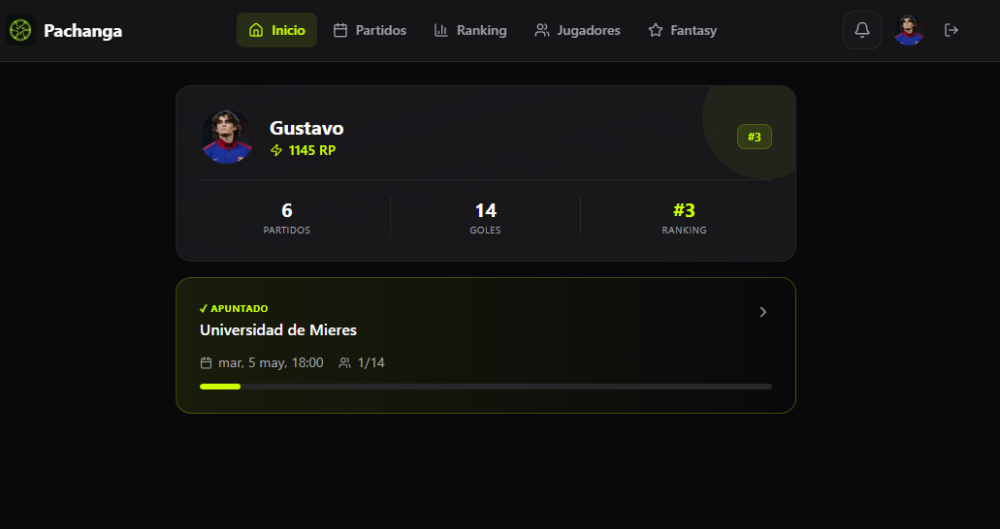
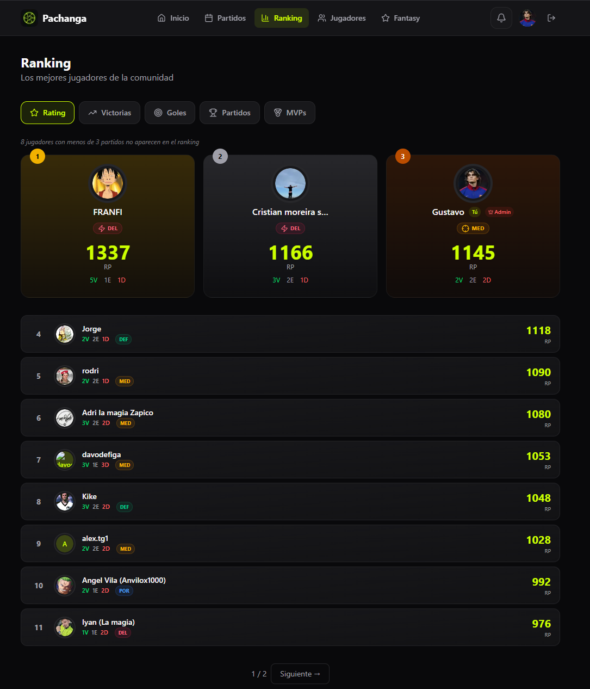
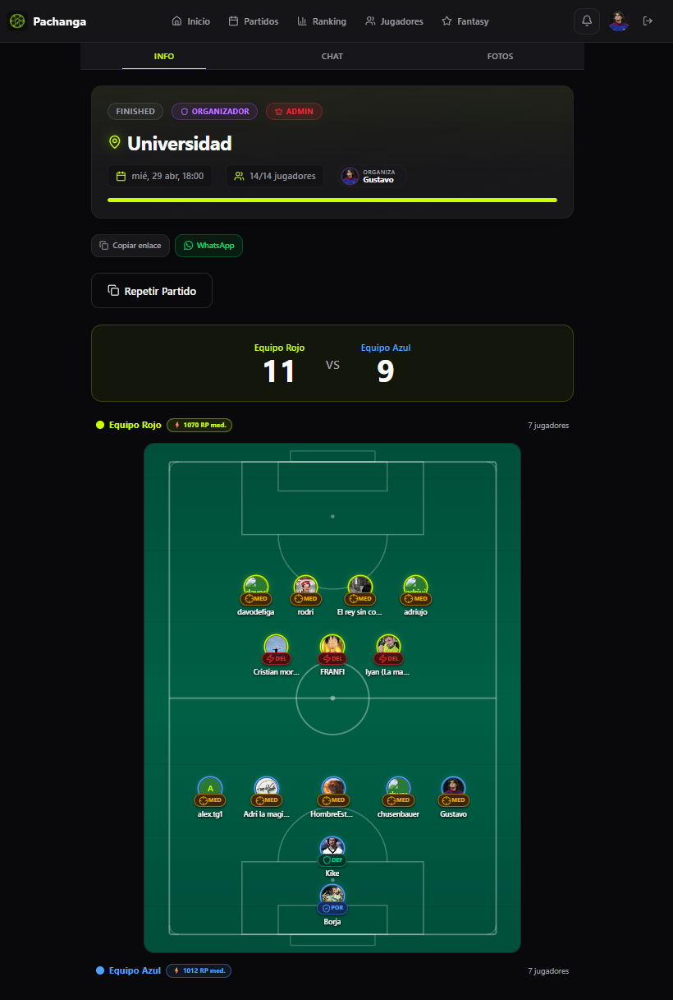
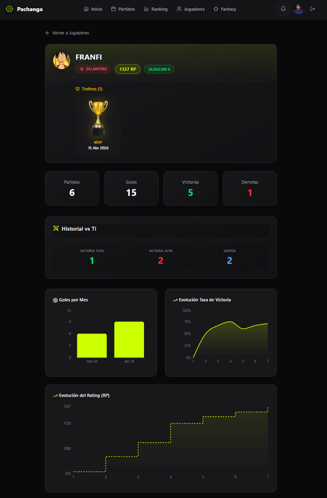

<div align="center">


**Plataforma full-stack para organizar partidos de fútbol con equipos balanceados por ELO, chat en tiempo real, estadísticas de jugadores y PWA instalable.**

> **[→ Ver demo en vivo](https://pachagas-app.vercel.app)**

[](https://nextjs.org/)
[](https://supabase.com/)
[](https://typescriptlang.org/)
[](https://playwright.dev/)
[](https://web.dev/progressive-web-apps/)

[Demo](#-demo) · [Highlights](#-highlights-técnicos) · [Características](#-características) · [Tech Stack](#️-tech-stack) · [Decisiones Técnicas](#-decisiones-técnicas) · [Instalación](#-instalación) · [Deploy](#-deploy)

</div>

---

## 📸 Demo

> 👥 **31 jugadores registrados** · ⚽ **101 goles marcados** · 🏟️ **9 partidos organizados** — datos reales de producción.

> Lanza `npm run dev` y accede a `http://localhost:3000` para explorar la app.

<table>
  <tr>
    <td align="center" width="50%">
      <br>
      <sub><b>Pantalla principal</b></sub>
    </td>
    <td align="center" width="50%">
      <br>
      <sub><b>Ranking global</b></sub>
    </td>
  </tr>
  <tr>
    <td align="center" width="50%">
      <br>
      <sub><b>Detalle de partido con cancha visual</b></sub>
    </td>
    <td align="center" width="50%">
      <br>
      <sub><b>Perfil de jugador con estadísticas</b></sub>
    </td>
  </tr>
</table>

---

## ⚡ Highlights técnicos

- **ELO + balanceo en 3 fases** — Draft posicional → igualación de tamaño → swap-optimisation iterativo. Converge en óptimo local en 2-3 pasadas.
- **Server Components + Server Actions** — Las páginas de lectura pesada (perfil, ranking) no envían JS al cliente. Solo se hidratan los componentes interactivos (chat, notificaciones, gráficas).
- **Realtime sobre CDC de PostgreSQL** — Chat y notificaciones via Supabase Realtime, sin polling. La misma conexión que la base de datos.
- **RLS como capa de autorización** — Todas las reglas de acceso viven en PostgreSQL como políticas declarativas, no en la capa de aplicación.
- **Rate limiting por token bucket** — Protección contra spam en server actions críticos implementada desde cero, sin librerías externas.
- **PWA installable** — Manifest + service worker. Funciona como app nativa en Android/iOS desde el navegador.

---

## ✨ Características

### Core

| Feature | Descripción |
|---------|-------------|
| 🔐 **Autenticación** | Email/contraseña + Google OAuth via Supabase Auth |
| 👤 **Perfiles** | Avatar, posición, nivel de habilidad, estadísticas |
|  **Gestión de Partidos** | Crear, unirse, abandonar, cerrar y finalizar partidos |
| ⚖️ **Generador de Equipos** | Algoritmo de balanceo por nivel de habilidad |
| 🏟️ **Cancha Visual** | Representación visual del campo con posiciones de jugadores |
| 📊 **Resultado y Goleadores** | Registro de marcador y goles individuales |

### Social

| Feature | Descripción |
|---------|-------------|
| 💬 **Chat por Partido** | Mensajería en tiempo real con Supabase Realtime |
| 📷 **Fotos Post-Partido** | Galería con upload a Supabase Storage + lightbox |
| ⭐ **Valoraciones** | Puntúa a otros jugadores (puntualidad, deportividad, nivel) |
| 🔔 **Notificaciones** | Alertas en tiempo real: uniones, equipos, resultados |
| 📤 **Compartir Partido** | Enlace directo, WhatsApp y Telegram |

### AI Assistant

| Feature | Descripción |
|---------|-------------|
| 🤖 **Panenka** | Asistente conversacional con acceso a datos reales de la app |
| 📊 **Consultas sobre el juego** | Ranking, goleadores, estadísticas propias, historial y comparativas entre jugadores |
| 📈 **Análisis temporal** | Calcula ritmo de goles por mes, progresión y tendencias desde el historial real |
| 💬 **Markdown enriquecido** | Respuestas con tablas, negrita y listas renderizadas en el chat |
| ⚡ **~1.400 tokens/petición** | Eficiencia alta gracias al modelo y schemas compactos |

### Analytics & Discovery

| Feature | Descripción |
|---------|-------------|
| 📈 **Gráficas de Jugador** | Goles/mes (barras) + evolución de winrate (área) |
| 🏆 **Ranking Global** | Tabla de clasificación por partidos, goles y MVPs |
| 📅 **Calendario** | Vista mensual con indicadores de estado por color |
| 📜 **Historial** | Todos tus partidos con resultado, W/D/L y goles |
| 👥 **Directorio de Jugadores** | Browse de todos los usuarios con stats y perfil |

### Plataforma

| Feature | Descripción |
|---------|-------------|
| 📱 **PWA** | Instalable como app nativa (manifest + service worker) |
| 🌙 **Dark Mode** | Tema oscuro premium con acentos verde neón `#ccff00` |
| 🛡️ **Rate Limiting** | Protección contra spam en acciones críticas |
| 🧪 **E2E Tests** | Suite de Playwright con 10 tests automatizados |

---

## 🛠️ Tech Stack

```
Frontend       Next.js 16 (App Router) + React 19 + TypeScript
Styling        Tailwind CSS 4 (via @tailwindcss/postcss)
Database       Supabase (PostgreSQL) + Row Level Security
Auth           Supabase Auth (Email + Google OAuth)
Storage        Supabase Storage (avatars + match photos)
Realtime       Supabase Realtime (chat + notificaciones)
AI             Vercel AI SDK v6 · @ai-sdk/groq · openai/gpt-oss-20b
Charts         Recharts 3
Icons          Lucide React
Testing        Playwright (Chromium)
Deploy         Vercel (recomendado)
```

---

## 🚀 Instalación

### Prerrequisitos

- **Node.js** ≥ 18
- **npm** ≥ 9
- Una cuenta de [Supabase](https://supabase.com/) (free tier funciona)

### Setup

```bash
# 1. Clonar el repositorio
git clone https://github.com/gustavintavo8/PachagasApp
cd PachagasApp

# 2. Instalar dependencias
npm install

# 3. Configurar variables de entorno
cp .env.example .env.local
# Edita .env.local con tus credenciales de Supabase

# 4. Lanzar en modo desarrollo
npm run dev
```

### Tablas necesarias en Supabase

Crea las siguientes tablas en tu Supabase Dashboard o via SQL Editor:

| Tabla | Columnas clave |
|-------|---------------|
| `profiles` | id, username, avatar_url, position, skill_level (identidad; conserva columnas legacy durante la transición) |
| `seasons` | id, name, slug, status, starts_at, ends_at |
| `season_player_stats` | season_id, user_id, elo_rating, matches_played, goals_scored, wins, draws, losses, mvps |
| `community_access_grants` | user_id, granted_at, revoked_at |
| `matches` | id, date, location, max_players, status, team_a_score, team_b_score, created_by |
| `match_participants` | id, match_id, user_id, team, goals, is_mvp |
| `match_comments` | id, match_id, user_id, content, created_at |
| `match_photos` | id, match_id, user_id, photo_url, created_at |
| `notifications` | id, user_id, type, title, message, match_id, read, created_at |
| `player_ratings` | id, match_id, rater_id, rated_id, punctuality, sportsmanship, skill, created_at |

> **Storage bucket:** `match_photos` (público)
> **Realtime:** Habilitar replicación para `notifications` y `match_comments`

`profiles` almacena la identidad y los datos básicos del jugador. Los contadores competitivos son estacionales y su fuente principal es `season_player_stats`; las columnas legacy de `profiles` se conservan durante la transición. El acceso a la comunidad es privado: una cuenta autenticada sin un grant activo debe canjear `PACHANGA_ACCESS_CODE` en `/access`. El código se configura únicamente en el entorno server-side y nunca debe publicarse ni commitearse. Fantasy permanece desactivado aunque sus tablas se conserven para una futura reactivación.

---

## 🔑 Variables de Entorno

```env
# .env.local
NEXT_PUBLIC_SUPABASE_URL=https://tu-proyecto.supabase.co
NEXT_PUBLIC_SUPABASE_ANON_KEY=eyJ...
SUPABASE_SERVICE_ROLE_KEY=eyJ...
```

| Variable | Descripción |
|----------|-------------|
| `NEXT_PUBLIC_SUPABASE_URL` | URL de tu proyecto Supabase |
| `NEXT_PUBLIC_SUPABASE_ANON_KEY` | Clave anónima pública |
| `SUPABASE_SERVICE_ROLE_KEY` | Clave de servicio (solo server-side, para admin ops) |
| `GROQ_API_KEY` | API key de [GroqCloud](https://console.groq.com/) para el asistente Panenka |

---

## 🧪 Tests

```bash
# Instalar navegadores de Playwright (solo la primera vez)
npx playwright install chromium

# Ejecutar todos los tests
npx playwright test

# Ver el reporte HTML
npx playwright show-report
```

---

## 🚢 Deploy

### Vercel (recomendado)

1. Conecta tu repositorio en [Vercel](https://vercel.com/)
2. Añade las variables de entorno en Settings → Environment Variables
3. Deploy automático en cada push a `main`

### Otros

```bash
# Build de producción
npm run build

# Lanzar servidor de producción
npm start
```

---

## 📂 Estructura del Proyecto

```
src/
├── app/
│   ├── api/asistente/       # API route del asistente Panenka (streamText)
│   ├── asistente/           # Chat con Panenka (UI)
│   ├── auth/callback/       # OAuth callback handler
│   ├── fantasy/             # Clasificación y mercado fantasy
│   ├── history/             # Historial de partidos
│   ├── leaderboard/         # Ranking global
│   ├── login/               # Autenticación
│   ├── matches/             # Partidos (activos + historial)
│   │   └── [id]/            # Detalle de partido (chat, fotos, rating)
│   ├── players/             # Directorio de jugadores
│   │   └── [id]/            # Perfil de jugador (stats, charts, ratings)
│   └── profile/             # Perfil propio
├── components/
│   ├── ui/                  # Componentes base (Button, Card, Avatar, Dialog)
│   ├── MatchChat.tsx        # Chat en tiempo real
│   ├── MatchPhotos.tsx      # Galería de fotos
│   ├── NavbarClient.tsx     # Barra de navegación
│   ├── NotificationBell.tsx # Campana de notificaciones
│   ├── PlayerCharts.tsx     # Gráficas de rendimiento
│   └── PlayerRating.tsx     # Sistema de valoraciones
├── lib/
│   ├── ai/                  # Herramientas del asistente (tools.ts)
│   ├── supabase/            # Clientes Supabase (server, client, admin)
│   ├── elo.ts               # Lógica de cálculo ELO
│   ├── rate-limit.ts        # Rate limiter (token bucket)
│   ├── team-balancer.ts     # Algoritmo de balanceo de equipos
│   └── utils.ts             # Utilidades compartidas
└── middleware.ts             # Auth middleware
```

---

## 🧠 Decisiones Técnicas

### Por qué Supabase en vez de Firebase

Firebase fue descartado por dos razones concretas: su modelo de datos (documentos anidados en Firestore) no encaja bien con relaciones muchos-a-muchos como `match_participants` o `player_ratings`, donde las queries relacionales son frecuentes. Supabase ofrece PostgreSQL real — se pueden hacer JOINs, agregaciones y Row Level Security con políticas declarativas en SQL, sin necesidad de duplicar datos ni mantener contadores manualmente. El Realtime de Supabase (basado en CDC de PostgreSQL) cubre el chat y las notificaciones con un modelo pub/sub sencillo desde el mismo cliente.

### Por qué Next.js App Router

El App Router permite mezclar Server Components y Client Components en el mismo árbol. Las páginas de perfil, ranking y detalle de partido son mayoritariamente lecturas: se renderizan en servidor (sin JavaScript en cliente, sin spinner de carga), y solo los componentes interactivos — chat, campana de notificaciones, gráficas — se hidratan como Client Components. Esto da tiempos de carga percibidos bajos sin sacrificar interactividad. Los Server Actions eliminan la necesidad de una API REST propia para las mutaciones.

### Algoritmo de balanceo de equipos

El balanceo se resuelve en tres fases sobre los ratings ELO de cada jugador:

**Fase 1 — Draft posicional:** Los jugadores se agrupan por posición (GK → DEF → MID → FWD) y dentro de cada grupo se ordenan por ELO descendente. Se asignan en zigzag al equipo con menos jugadores en esa posición; en caso de empate, al equipo con menor ELO promedio. Así se garantiza paridad posicional antes de optimizar.

**Fase 2 — Igualación de tamaño:** Si los equipos quedan desiguales en número (partidos con número impar de jugadores), se mueve el jugador cuyo traspaso minimiza la diferencia de ELO promedio resultante — no simplemente el último de la lista.

**Fase 3 — Optimización por intercambio:** Se prueban todos los pares A↔B posibles; si un intercambio reduce la diferencia de ELO promedio en más de 0.5 puntos, se confirma y se reinicia el paso. El algoritmo converge en 2-3 iteraciones hacia un óptimo local. El umbral de 0.5 evita micro-swaps infinitos por ruido de punto flotante.

El resultado es equipos con diferencia de ELO promedio cercana a cero, respetando la distribución posicional del partido.

---

### Asistente Panenka — arquitectura y decisiones de modelo

Panenka es un asistente conversacional integrado en la app que responde preguntas sobre jugadores, partidos y estadísticas estacionales consultando la base de datos en tiempo real. La implementación usa **Vercel AI SDK v6** con un sistema de herramientas (_tool use_ / function calling) que permite al modelo razonar sobre cuándo y qué datos consultar.

**Elección de proveedor y modelo — `openai/gpt-oss-20b` vía Groq**

El proceso de selección pasó por varias iteraciones:

- **Google Gemini** (inicial): descartado por cuotas de RPM extremadamente bajas en el free tier y errores frecuentes de "high demand" con los modelos 2.5.
- **Groq + Llama 3.3 70B**: mejor disponibilidad, pero el modelo generaba JSON inválido en los tool calls de forma impredecible (`Failed to call a function`), lo que hacía el asistente poco fiable.
- **Groq + Llama 3.1 8B Instant**: más rápido y con mayor TPM en free tier, pero demasiado pequeño para function calling consistente — inventaba respuestas sin llamar a las herramientas.
- **Groq + `openai/gpt-oss-20b`** ✅: arquitectura OpenAI con function calling fiable, corriendo en hardware Groq a ~1.000 t/s. Consume ~1.400 tokens por petición (frente a los 7.000 del 70B), con 250.000 TPM en Developer Plan.

**`jsonSchema()` en lugar de `zodSchema()`**

Zod v4 convierte los campos `.optional()` en `anyOf: [{type: "X"}, {type: "null"}]` al generar el JSON Schema. Groq no soporta este patrón en function calling y devuelve error. La solución fue reemplazar `zodSchema()` por `jsonSchema()` de `"ai"` con schemas manuales explícitos donde los campos opcionales simplemente no aparecen en el array `required`, sin unions con null.

**Herramientas de consulta disponibles**

| Tool | Descripción |
|------|-------------|
| `get_my_stats` | ELO, goles, partidos y posición en el ranking del usuario autenticado |
| `get_my_matches` | Historial de partidos con fecha, goles y MVP — para análisis temporal |
| `get_player_detail` | Perfil y ranking de cualquier jugador (búsqueda por username con wildcards) |
| `get_players` | Lista de jugadores con filtros de posición y rango ELO |
| `get_matches` | Partidos con filtros de estado y rango de fechas |
| `get_match_detail` | Resultado, participantes, goles y MVP de un partido concreto |
| `get_leaderboard` | Ranking ELO global (mínimo 3 partidos) |
| `get_top_scorers` | Ranking de máximos goleadores |
| `get_players_history_together` | Partidos en los que dos jugadores han coincidido |

**Rendering de respuestas**

Las respuestas del modelo se renderizan como Markdown mediante `react-markdown` + `remark-gfm`, lo que permite tablas comparativas, texto en negrita y listas estructuradas directamente en el chat.

---

## 📄 Licencia

MIT © Pachanga

---

<div align="center">
  <sub>Built with ☕ and  for futboleros everywhere.</sub>
</div>
